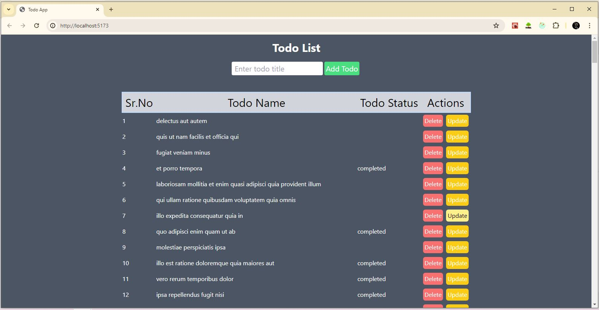

# TodoList App

This TodoList app allows users to manage their tasks by fetching, adding, updating, and deleting todo items. It utilizes React for the frontend and communicates with the JSONPlaceholder API for dummy CRUD operations.

## Features

- Fetch todo items from the API
- Add new todo items
- Update existing todo items
- Delete todo items

## Folder Structure
```
todo-list-app/
├── public/
│ └── 
├── src/
│ ├── components/
│ │ ├── Home.jsx
│ │ ├── TodoList.jsx
│ │ ├── TodoItem.jsx
│ │ └── AddTodoForm.jsx
│ ├── asset/
│ │ └── 
│ ├── App.js
│ └── main.js
├── package.json
└── README.md

```


## Home Page



## Installation

1. Clone the repository:
    ```bash
    git clone https://github.com/Sam21sop/To-Do-App.git 


2. Navigate to the project directory:
    ```bash
    cd To-Do-App


3. Install dependencies:
    ```bash
    npm install


## Usage

1. Start the development server:
    ```bash
    npm run dev